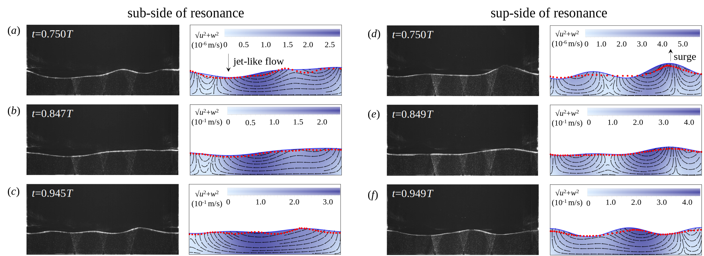
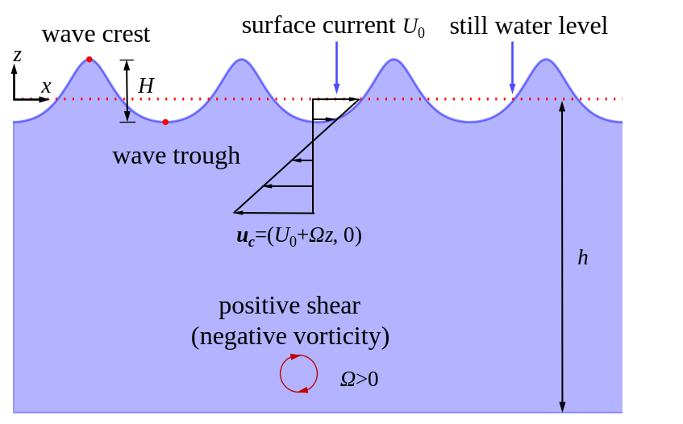
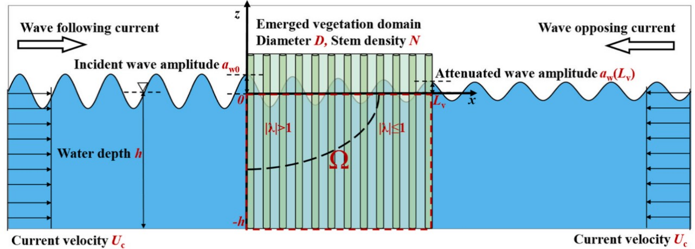

I am a first-year PhD student in the Department of Civil Engineering at Columbia University, where I obtained my M.E. and B.E. from Sichuan University.

During my master’s program, I was supervised by <a href="https://scholar.google.com/citations?user=3wRV9PEAAAAJ&hl=zh-CN&oi=ao">Prof. Pengzhi Lin</a> and <a href="https://scholar.google.com/citations?user=Xs4JPWwAAAAJ&hl=zh-CN&oi=ao">Prof. Philip L.-F. Liu</a>.

My research interests include coastal engineering, coastal oceanography, and surface gravity waves.

<h2>Research Projects</h2>

<h3>The Near-Resonance Liquid Sloshing under Surge Excitation</h3>

This study focuses on liquid sloshing near secondary resonance. We formulated a new closed-form analytical solution to examine the differences in wave dynamics on the sup- and sub-sides of the secondary resonance. We discovered a phase transition when the excitation frequency exceeds the resonance point, demonstrating that second-order free surface waves dominate this process. Experiments support our findings, revealing how different behaviors influence breaking patterns and the dependence of the breaking point on external excitation amplitude.

<video width="550" controls>
  <source src="./images/vedio5.mp4" type="video/mp4">
  Your browser does not support the video tag.
</video>

<strong>Publication:</strong>

<ul>
<li><strong>Haiqi Fang</strong>, Pengzhi Lin, 2024. (under review) The near-resonance liquid sloshing under surge excitations: theory and experiment. Submitted to <em>Proc. R. Soc. A</em>.</li>
</ul>

<h3>Stokes Waves in a Linear Shear Current</h3>

In coastal and deep-water areas, shear currents with vorticity are often generated by wind stress, affecting the dynamic properties of nonlinear waves. We discovered that, for strongly sheared currents, existing solutions became unstable, showing pronounced secondary fluctuations. By removing the non-physical assumption (i.e., wave height equals two times the first-order wave amplitude \( H = 2A \)), we proposed a more physical solution. This solution better describes waves with higher nonlinearity and stronger currents.

<strong>Publication:</strong>

<ul>
<li><strong>Haiqi Fang</strong>, Philip L.-F. Liu, Lian Tang, Pengzhi Lin, 2023. The theory of fifth-order Stokes waves in a linear shear current. <em>Proc. R. Soc. A</em>, 479: 20230565. <a href="https://doi.org/10.1098/rspa.2023.0565">doi: 10.1098/rspa.2023.0565</a></li>
</ul>

<h3>Wave Scattering by Coastal Sandbars</h3>

Natural sandbars in coastal seabeds can reflect surface waves. Classical theory indicates that resonance occurs when the ratio of the wavenumber of the sandbars to that of the incident waves equals two. Engineers have widely applied this to design artificial bars that protect coastal infrastructures.

However, in practice, real resonance typically occurs when the ratio is less than two, indicating a ‘downshift’ behavior. This has been observed both experimentally and numerically for decades, but the formative mechanism has remained unclear. Moreover, existing analytical solutions either lead to unbounded solutions at resonance or cannot predict the downshift. The practical significance and limitations in existing theories inspired me to develop a new theory. Finally, based on the multi-scale expansion method, I proposed new nonlinear coupled equations and closed-form analytical solutions. The solutions not only remain valid and bounded under any condition but also effectively capture the downshift. My study further revealed the underlying mechanism of the downshift, arising from wave re-reflection and modulation processes that lead to a detuning of wave speed.

  

<strong>Publication:</strong>

<ul>
<li><strong>Haiqi Fang</strong>, Lian Tang, Pengzhi Lin, 2024. Bragg scattering of nonlinear surface waves by sinusoidal sandbars. <em>J. Fluid Mech.</em>, 979: A13. <a href="https://doi.org/10.1017/jfm.2023.1005">doi: 10.1017/jfm.2023.1005</a></li>
<li><strong>Haiqi Fang</strong>, Lian Tang, Pengzhi Lin, 2024. Theoretical study on the downshift of class II Bragg resonance. <em>Phys. Fluids</em>, 36: 017103. <a href="https://doi.org/10.1063/5.0178754">doi: 10.1063/5.0178754</a></li>
</ul>

<h3>Wave Transformation over 2-D and 3-D Permeable Varying Seabeds</h3>

As my initial project, I studied wave transformation over porous structures. Strong nonlinearity and singularities, introduced by permeable effects, made the analysis rather challenging using traditional methods. For this reason, I was motivated to find a more effective tool, and the Homotopy analysis method was the ideal candidate due to its ability to decompose a nonlinear differential operator into linear ones. Eventually, I constructed Homotopy equations and introduced differential transformations to avoid singularities, and successfully proposed analytical solutions.

  
  

<strong>Publication:</strong>

<ul>
<li><strong>Haiqi Fang</strong>, Lian Tang, Pengzhi Lin, 2023. Homotopy analysis of wave transformation over permeable seabeds and porous structures. <em>Ocean Eng.</em>, 274: 114087. <a href="https://doi.org/10.1016/j.oceaneng.2023.114087">doi: 10.1016/j.oceaneng.2023.114087</a></li>
</ul>

<h3>Wave Attenuation by Vegetation Considering Current Effects</h3>

As a co-author, I was responsible for formulating the theoretical solutions. We established solutions for wave attenuation by vegetation under both strong and weak currents, incorporating a new parameterization for the drag coefficient.

<strong>Publication:</strong>

<ul>
<li>Huiran Liu, <strong>Haiqi Fang</strong>, Pengzhi Lin, 2024. A theoretical model for wave attenuation by vegetation considering current effects. <em>Coast. Eng.</em>, 190: 104508. <a href="https://doi.org/10.1016/j.coastaleng.2024.104508">doi: 10.1016/j.coastaleng.2024.104508</a></li>
</ul>

