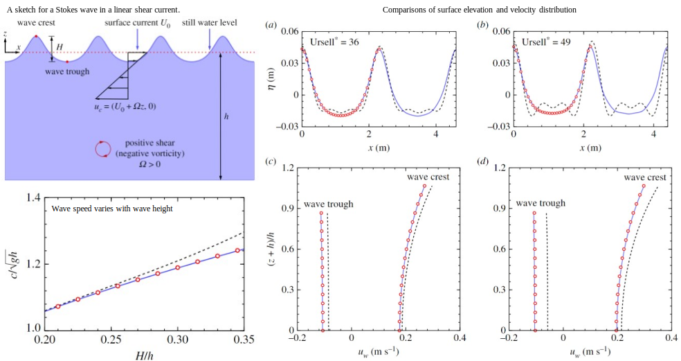

I am a first year PhD student in the department of Civil Engineering at Columbia University. I obtained my M.E. and B.E. at Sichuan Univeristy. 

My research interest includes coastal engineering, coastal oceanography and surface gravity waves.

# Research projects

## Stokes waves in a linear shear current

In coastal and deep-water areas, shear currents with vorticity are often generated by wind stress, affecting the dynamic properties of nonlinear waves. 

(1) We have discovered that for strongly sheared currents, existing solutions became unstable with pronounced secondary fluctuations, and we intended to formulate a solution with improved performance.

(2) By removing the non-physical assumption, namely wave height equals two times of the first-order wave amplitude (H=2A), and compensating with a new time-scale transformation to ensure solvability. 

(3) We proposed a more physical solution that, compared with existing ones, can better describe waves with higher nonlinearity and in stronger currents.

*Publication:*

1. **Haiqi Fang**, Philip L.-F. Liu, Lian Tang, Pengzhi Lin, 2023. The theory of fifth-order
			Stokes waves in a linear
			shear current. *Proc. R. Soc. A*, 479: 20230565. [doi: 10.1098/rspa.2023.0565](https://doi.org/10.1098/rspa.2023.0565)
   

## Wave Scattering by coastal sandbars

Natural sandbars in coastal seabeds can reflect surface waves, and classical theory indicates that resonance occurs when the ratio of the wavenumber of the sandbars to that of the incident waves equals two. Engineers have widely applied this to design artificial bars that protect coastal infrastructures. 

However, in practice, real resonance typically occurs when the ratio is less than two, indicating a ‘downshift’ behavior. This has been observed both experimentally and numerically for decades, but the formative mechanism has remained unclear. Moreover, existing analytical solutions either lead to unbounded solutions at resonance or cannot predict the downshift. The practical significance and limitations in existing theories inspired me to develop a new theory. Finally, based on the multi-scale expansion method, I proposed new nonlinear coupled equations and closed-form analytical solutions. The solutions not only remain valid and bounded under any condition, but also effectively capture the downshift. My study further revealed the underlying mechanism of the downshift, which arises from wave re-reflection and modulation processes that lead to a detuning of wave speed.

<video width="320" height="180" controls>
  <source src="../images/vedio1.mp4" type="video/mp4">
  Your browser does not support the video tag.
</video>

*Publication:*

1. **Haiqi Fang**, Lian Tang, Pengzhi Lin, 2024. Bragg scattering of nonlinear surface waves by sinusoidal sandbars. *J. Fluid Mech.*, 979: A13. [doi: 10.1017/jfm.2023.1005](https://doi.org/10.1017/jfm.2023.1005)

2. **Haiqi Fang**, Lian Tang, Pengzhi Lin, 2024. Theoretical study on the downshift of class II Bragg resonance. *Phys. Fluids*, 36: 017103. [doi: 10.1063/5.0178754](https://doi.org/10.1063/5.0178754)

## Wave transformation over 2-D and 3-D permeable varying seabeds

As my initial project, I studied wave transformation over porous structures. Strong nonlinearity and singularities, introduced by permeable effects, made the analysis rather challenging using traditional methods. For this reason, I was motivated to find a more effective tool, and the Homotopy analysis method was the ideal candidate due to its ability to decompose a nonlinear differential operator into linear ones. Eventually, I constructed Homotopy equations and introduced differential transformations to avoid singularities, and successfully proposed analytical solutions.

  
  

*Publication:*

1. **Haiqi Fang**, Lian Tang, Pengzhi Lin, 2023. Homotopy analysis of wave transformation over permeable
seabeds and porous structures. *Ocean Eng.*, 274: 114087. [doi: 10.1016/j.oceaneng.2023.114087](https://doi.org/10.1016/j.oceaneng.2023.114087)

## Wave attenuation by vegetation considering current effects

As my initial project, I studied wave transformation over porous structures. Strong nonlinearity and singularities, introduced by permeable effects, made the analysis rather challenging using traditional methods. For this reason, I was motivated to find a more effective tool, and the Homotopy analysis method was the ideal candidate due to its ability to decompose a nonlinear differential operator into linear ones. Eventually, I constructed Homotopy equations and introduced differential transformations to avoid singularities, and successfully proposed analytical solutions.

  
  

*Publication:*

1. Huiran Liu, **Haiqi Fang**, Pengzhi Lin, 2024. A theoretical model for wave attenuation by vegetation considering current effects. *Coast. Eng.*,  190: 104508. [doi: 10.1016/j.coastaleng.2024.104508](https://doi.org/10.1016/j.coastaleng.2024.104508)

